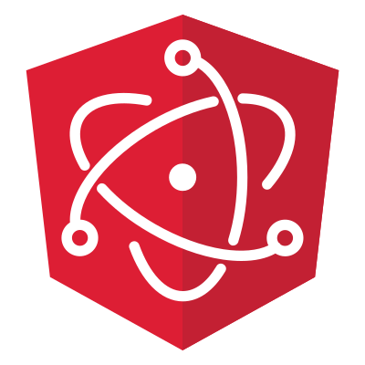

<p align="center">
  
</p>

# :point_right: Introduction

**Create desktop apps with Angular and electron.**

> This project is based on [angular-electron](https://github.com/maximegris/angular-electron)

Currently runs with:

- Angular v9
- Electron v8
- Electron Builder v22
- Angular material v9

# :sparkles: Features

- Run your app in a local development environment with Electron & Hot reload
- Run your app in a production environment
- Package your app into an executable file for Linux, Windows & Mac with [electron-builder](https://www.electron.build/)
- [Build&Release](doc/devlopment/release.md) your app with [Github Actions](https://help.github.com/en/actions)
- Integrated devtron
- [Debug](doc/devlopment/debug.md) renderer process with vscode

#### Todo
- [ ] Integrated augury
- [ ] Debug main precess with vscode

> :warning: Hot reload only pertains to the renderer process. The main electron process is not able to be hot reloaded, only restarted.

> :warning: Angular 9.x CLI needs Node 10.13 or later to works correctly.

# :airplane: Getting Started

1. Clone this repository locally :

```bash
git clone --depth=1 git@github.com:TobiasTao/electron-angular-boilerplate.git your-app-name
```

2. Install dependencies with npm :

```bash
npm install
```

> :warning: There is an issue with `yarn` and `node_modules` when the application is built by the packager. Please use `npm` as dependencies manager.

3. Start app:

```bash
npm start
```

You can use your Angular + Electron app in a local development environment with hot reload !

The application code is managed by `main.ts`. In this sample, the app runs with a simple Angular App (http://localhost:4200) and an Electron window.
The Angular component contains an example of Electron and NodeJS native lib import.
You can disable "Developer Tools" by commenting `win.webContents.openDevTools();` in `main.ts`.

### Included Commands

| Command                    | Description                                                                                                 |
| -------------------------- | ----------------------------------------------------------------------------------------------------------- |
| `npm run build`            | Build the app. Your built files are in the /dist folder.                                                    |
| `npm run build:prod`       | Build the app with Angular aot. Your built files are in the /dist folder.                                   |
| `npm run electron:local`   | Builds your application and start electron                                                                  |
| `npm run electron:linux`   | Builds your application and creates an app consumable on linux system                                       |
| `npm run electron:windows` | On a Windows OS, builds your application and creates an app consumable in windows 32/64 bit systems         |
| `npm run electron:mac`     | On a MAC OS, builds your application and generates a `.app` file of your application that can be run on Mac |

**Your application is optimised. Only /dist folder and node dependencies are included in the executable.**

### You want to use a specific lib (like rxjs) in electron main thread ?

YES! You can do it! Just by importing your library in npm dependencies section (not **devDependencies**) with `npm install --save`. It will be loaded by electron during build phase and added to your final package. Then use your library by importing it in `main.ts` file. Quite simple, isn't it ?

# :scroll: License

The MIT License (MIT)

Copyright (c) 2020 tyc1998
